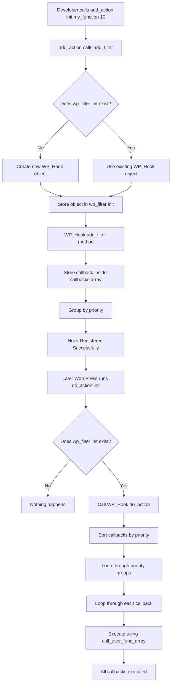
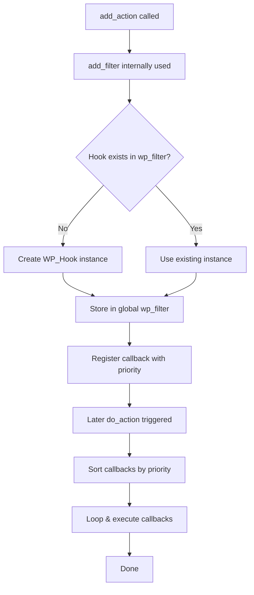

# WordPress Hook System – Behind the Scenes

A simple and clear explanation of how `add_action()` and `add_filter()` work internally in WordPress.

No long theory. Just how the engine works.

---

## 1️⃣ Important Truth

```
add_action() === add_filter()
```

In WordPress core:

```php
function add_action($hook, $callback, $priority = 10, $accepted_args = 1) {
    return add_filter($hook, $callback, $priority, $accepted_args);
}
```

Actions and filters use the same internal system.

---

## 2️⃣ Global Storage: `$wp_filter`

All hooks are stored inside a global variable:

```php
global $wp_filter;
```

Structure:

```php
$wp_filter = [
    'hook_name' => WP_Hook Object
];
```

Each hook name stores a `WP_Hook` object.

---

## 3️⃣ What Happens When You Call `add_action()`

Example:

```php
add_action('init', 'my_function', 10, 1);
```

Internally WordPress does something like:

```php
global $wp_filter;

if (!isset($wp_filter['init'])) {
    $wp_filter['init'] = new WP_Hook();
}

$wp_filter['init']->add_filter(
    'init',
    'my_function',
    10,
    1
);
```

### Step-by-step:

1. Check if hook exists  
2. If not → create `WP_Hook` instance  
3. Store callback inside the object  

---

## 4️⃣ Simplified `WP_Hook` Class

```php
class WP_Hook {

    public $callbacks = [];

    public function add_filter($hook, $callback, $priority, $accepted_args) {
        $this->callbacks[$priority][] = [
            'function'      => $callback,
            'accepted_args' => $accepted_args,
        ];
    }

    public function do_action($args) {
        ksort($this->callbacks);
        foreach ($this->callbacks as $priority => $functions) {
            foreach ($functions as $data) {
                call_user_func_array($data['function'], $args);
            }
        }
    }
}
```

Hooks are just:

- Arrays  
- Objects  
- Loops  
- `call_user_func_array()`  

Nothing magical.

---

## 5️⃣ Full Internal Hook Flow



---

## 6️⃣ Beginner-Friendly Flow



---

## 7️⃣ Filter Value Flow (Step by Step)

```mermaid
flowchart TD
A[Initial value: "hello"] --> B[apply_filters 'the_title']
B --> C[Callback 1: strtoupper -> "HELLO"]
C --> D[Callback 2: add_emoji -> "🎉 HELLO"]
D --> E[Final value returned: "🎉 HELLO"]
```

---

## 8️⃣ Why Unique IDs Exist

WordPress creates a unique ID for each callback so:

```php
remove_action('init', 'my_function', 10);
```

works correctly. Without unique IDs, removing callbacks could fail.

---

## 9️⃣ Key Takeaways

- `add_action()` is an alias of `add_filter()`  
- Hooks are stored in `$wp_filter`  
- Each hook is a `WP_Hook` object  
- Callbacks are grouped by priority  
- Lower priority runs first  
- Internally → arrays + objects + loops  

---

## 🧠 Mental Model

```
Event Name → Object → Priority Buckets → Callback List → Execute
```

It’s basically an Event Dispatcher pattern.
